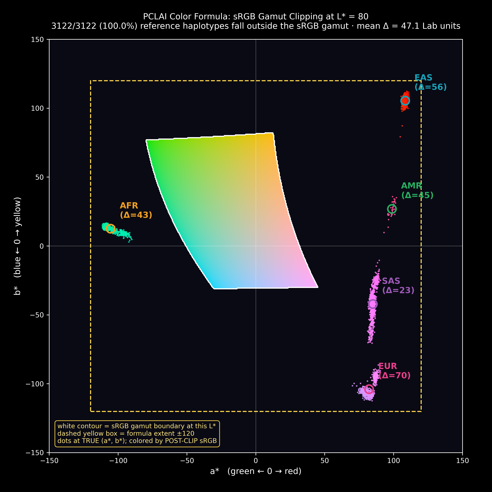

# A Critical Analysis of the PCLAI Color Ramp Strategy

**Paper:** *Point Cloud Local Ancestry Inference (PCLAI)*  
**Published in:** *Nature Genetics*, 2026  
**Preprint:** [https://www.biorxiv.org/content/10.64898/2026.03.23.713813v1](https://www.biorxiv.org/content/10.64898/2026.03.23.713813v1)  
**Source code:** [https://github.com/AI-sandbox/pclai](https://github.com/AI-sandbox/pclai)  
**Visualization module:** [`paintings.py`](https://raw.githubusercontent.com/AI-sandbox/pclai/main/paintings.py)  
**Reference panel:** `reference_pca_metadata.tsv` (3,122 reference haplotypes, provided with the project)

---

## 1. Background and Stated Design Rationale

PCLAI introduces a novel approach to local ancestry inference that produces, for each genomic window of a phased haplotype, a continuous coordinate in a PCA space rather than a discrete ancestry label. A central part of the contribution is a visualization system — chromosome paintings and PCA scatter backgrounds — in which every genomic window is assigned a colour derived from its predicted PCA coordinate.

The choice of colour space is deliberate and explicitly motivated. The authors use **CIELAB (L\*a\*b\*)**, the colour space defined by the International Commission on Illumination, whose principal property is **perceptual uniformity**: equal numerical distances in L\*a\*b\* space correspond to approximately equal perceived colour differences. Because the whitened PCA space used by PCLAI approximates a genetic drift metric — Euclidean distances in that space approximate Mahalanobis distances and hence coalescent times — mapping those distances into a perceptually uniform colour space would mean that **perceptibly similar colours indicate genetically similar ancestry**. This is a sound design principle and a genuine advance on arbitrary categorical colour schemes.

The question examined here is whether the implementation actually delivers on that principle.

---

## 2. The Implementation: Walking Through `pca_to_rgb_setup`

The entire colour system is implemented in a single function, `pca_to_rgb_setup`, in [`paintings.py`](https://raw.githubusercontent.com/AI-sandbox/pclai/main/paintings.py) (lines 247–285). The function is reproduced in full below.

```python
def pca_to_rgb_setup(founders_tsv, pca_constructor_path, scale_by_pca=True, margin=0.1):
    founders = pd.read_csv(founders_tsv, sep="\t")
    x1_f = founders["x1"].to_numpy(float)
    x2_f = founders["x2"].to_numpy(float)

    if scale_by_pca:
        with open(pca_constructor_path, "rb") as f:
            pca = pickle.load(f)
        s1 = float(np.sqrt(pca.explained_variance_[0]))
        s2 = float(np.sqrt(pca.explained_variance_[1]))
        x1_f, x2_f = x1_f / s1, x2_f / s2

    x1_min, x1_max = x1_f.min() - margin, x1_f.max() + margin
    x2_min, x2_max = x2_f.min() - margin, x2_f.max() + margin

    try:
        from skimage.color import lab2rgb

        def pca_to_rgb(x1, x2):
            L_fixed, ab_span = 80.0, 120.0
            a = ((x1 - x1_min) / (x1_max - x1_min + 1e-12) - 0.5) * 2.0 * ab_span
            b = ((x2 - x2_min) / (x2_max - x2_min + 1e-12) - 0.5) * 2.0 * ab_span
            L = np.full_like(a, L_fixed, float)
            Lab = np.stack([L, a, b], -1)
            return np.clip(lab2rgb(Lab[np.newaxis, ...])[0], 0, 1)

    except Exception:
        import matplotlib.colors as mcolors

        def pca_to_rgb(x1, x2):
            nx = (x1 - x1_min) / (x1_max - x1_min + 1e-12)
            ny = (x2 - x2_min) / (x2_max - x2_min + 1e-12)
            ang = np.arctan2(ny - 0.5, nx - 0.5)
            hue = (ang / (2 * np.pi)) % 1.0
            sat = np.clip(np.hypot(nx - 0.5, ny - 0.5) * np.sqrt(2), 0, 1)
            val = 0.92
            return mcolors.hsv_to_rgb(np.stack([hue, sat, np.full_like(hue, val)], -1))

    return pca_to_rgb
```

The function proceeds in four steps:

### Step 2.1 — Load reference haplotype coordinates

The reference panel (`reference_pca_metadata.tsv`) is read, providing x1 and x2 PCA coordinates for 3,122 reference haplotypes drawn from the 1000 Genomes Project and the Human Genome Diversity Project (HGDP). These coordinates represent the pooled, window-level PCA projections of each haplotype onto the principal components of the reference panel.

### Step 2.2 — Optional whitening

When `scale_by_pca=True` (the default), each axis is divided by the standard deviation of that principal component:

```
x1_scaled = x1 / √λ₁
x2_scaled = x2 / √λ₂
```

This places both axes in units of standard deviations under the reference panel and ensures that the colour gradient is proportional to genetic distance rather than raw coordinate magnitude. This is consistent with the whitening transformation described in the paper's methods (equations 1–2).

### Step 2.3 — Establish normalization bounds

The minimum and maximum of the (whitened) reference coordinates, expanded by a margin of 0.1, define the bounding box of the colour space:

```
x1_min = −1.913,   x1_max = 0.886
x2_min = −1.524,   x2_max = 1.609
```

### Step 2.4 — Map to CIELAB and convert to RGB

The core formula:

```
a* = ( (x1 − x1_min) / (x1_max − x1_min)  −  0.5 ) × 2 × 120
b* = ( (x2 − x2_min) / (x2_max − x2_min)  −  0.5 ) × 2 × 120
L* = 80   (constant)
RGB = clip(lab2rgb([L*, a*, b*]), 0, 1)
```

PC1 maps to the **a\*** axis (green ↔ red), PC2 maps to the **b\*** axis (blue ↔ yellow), and lightness is fixed at **L\* = 80**. The formula maps the full extent of the reference data to a\*, b\* ∈ [−120, +120]. The result is converted to sRGB via `skimage.color.lab2rgb` and clipped to [0, 1].

---

## 3. The Investigation: Testing the Gamut

### 3.1 Methodology

To evaluate whether the formula's output actually lies within the sRGB gamut, the investigation followed three steps:

**Step 1: Compute a\*, b\* for all 3,122 reference haplotypes** using the formula above, with the bounds derived from the actual `reference_pca_metadata.tsv` data.

**Step 2: Determine sRGB gamut membership** by converting each (L\*=80, a\*, b\*) triplet to linear sRGB without clipping, using the standard CIE XYZ pipeline. A point is in-gamut if and only if all three resulting linear RGB channels lie within [0, 1]. Any channel outside this range indicates a colour that cannot be represented in sRGB and will be clipped.

**Step 3: Map the full a\*b\* plane at L\*=80** using a 600×600 grid spanning [−150, +150] on each axis, to establish the shape and extent of the sRGB gamut boundary. This allows the formula's declared range to be shown against the actual gamut in the same coordinate system.

**Step 4: Compute clipping displacement** by passing each out-of-gamut point through `lab2rgb` (which clips internally), then converting the clipped sRGB value back to Lab using `rgb2lab`. The displacement is the Euclidean distance in Lab space between the original (intended) colour and the clipped (actually displayed) colour.

### 3.2 Results

The results are unambiguous.

| Metric | Value |
|---|---|
| Total reference haplotypes | 3,122 |
| Haplotypes within sRGB gamut | **0 (0.0%)** |
| Haplotypes outside sRGB gamut | **3,122 (100.0%)** |
| Computed a\* range | [−111.4, +111.4] |
| Computed b\* range | [−112.3, +112.3] |
| sRGB gamut area at L\*=80 | ~9,427 Lab units² |
| Formula bounding box area | 57,600 Lab units² |
| **Gamut as fraction of formula box** | **16.4%** |
| Mean clipping displacement | 44.8 Lab units |
| Median clipping displacement | 45.8 Lab units |
| Maximum clipping displacement | 77.4 Lab units |
| Minimum clipping displacement | 16.8 Lab units |

Clipping displacement by continental ancestry group:

| Group | n | Mean Displacement | Max Displacement |
|---|---|---|---|
| European (EUR) | 702 | 69.1 Lab units | 77.4 Lab units |
| East Asian (EAS) | 814 | 49.4 Lab units | 54.7 Lab units |
| African (AFR) | 764 | 42.6 Lab units | 47.8 Lab units |
| American (AMR) | 40 | 40.5 Lab units | 42.8 Lab units |
| West/Central Asian (WAS) | — | — | — |
| South Asian (SAS) | 802 | 21.0 Lab units | 35.9 Lab units |

---

## 4. The Diagram



The sRGB gamut projected onto the CIELAB (a\*, b\*) plane at L\*=80 (generated by `render_lab_gamut.py`; the projection method is documented in `render-lab-gamut-tutorial.md`). The coloured central region is the set of (a\*, b\*) values that sRGB can actually display at this lightness; the white contour is its boundary. The dashed yellow box is the formula's declared extent (±120). All 3,122 reference haplotypes are plotted at their true computed (a\*, b\*) positions, coloured by their *actual displayed value* — the post-clip RGB — not by the colour the formula intended. Every dot sits in the dark outer region, outside the gamut: not a single haplotype lands on a colour the display can reproduce. The Δ annotation on each population centroid is the mean Lab displacement from the true position to the clipped landing point. Because every point is clipped inward to the gamut edge, the displayed colour distribution is a compressed projection onto the one-dimensional gamut boundary, not the intended two-dimensional CIELAB surface.

---

## 5. Analysis of the Failures

### 5.1 The Perceptual Uniformity Guarantee Is Entirely Voided

The fundamental design rationale for using CIELAB was perceptual uniformity: equal distances in PCA space should produce equal perceived colour differences. This guarantee holds only *within* the gamut. The moment a colour is clipped, the mathematical relationship between coordinate distance and perceived colour difference is broken. The clip does not preserve relative distances — it projects all out-of-gamut points onto the nearest representable RGB, and that projection is neither linear nor uniform.

Since **100% of reference haplotypes** fall outside the gamut, the perceptual uniformity guarantee is voided for the entire dataset. Not partially undermined. Not degraded at the margins. Completely absent. The theoretical foundation of the colour strategy does not apply to a single data point actually displayed in the figures.

### 5.2 The Effective Colour Scale Is One-Dimensional

The design intended a rich 2D colour surface where every point in PCA space maps to a unique, informative colour drawn from the interior of the CIELAB colour solid. What is actually displayed is something fundamentally different: all population coordinates are projected onto the *edge* of the gamut at L\*=80, which is a closed curve — a one-dimensional boundary contour.

This collapses the design from a 2D encoding to a 1D encoding. Two points that are far apart in PCA space but happen to project to nearby points on the gamut boundary will appear visually similar. Two points that are close together in PCA space but whose radial direction from the PCA centre sends them to opposite sides of the gamut boundary may appear very different. The displayed colour difference no longer reflects the underlying genetic distance in any principled way.

### 5.3 The Two Parameters Are in Direct Contradiction

The formula has two free parameters that jointly determine whether outputs fall within the gamut: **L\*** (fixed lightness) and **ab_span** (the half-width of the a\*, b\* mapping). These two parameters are not independent. At L\*=80, the sRGB gamut extends to a maximum of roughly ±50–70 Lab units from the origin in the a\*b\* plane, depending on direction. Setting `ab_span=120` maps the full reference data to ±120, which is approximately 1.7–2.4× the gamut radius in every direction.

The formula's ±120 bounding box has an area of **57,600 Lab units²**. The sRGB gamut at L\*=80 occupies approximately **9,427 Lab units²** — just **16.4%** of that box. The other 83.6% of the declared colour space is not representable in sRGB at L\*=80.

Either parameter choice, in isolation, would be defensible. L\*=80 gives pleasant pastels and is common in scientific visualizations. An ab_span of 120 would give saturated, high-contrast colours at lower lightness values. Together, they create a system that declares a large colour space but can actually display only a small fraction of it.

### 5.4 The Clipping Is Unequal Across Population Groups

The displacement magnitudes are not uniform across ancestry groups. European haplotypes experience the largest mean displacement (69.1 Lab units), while South Asian haplotypes experience the smallest (21.0 Lab units). This introduces a systematic bias: the colour assigned to European ancestry is the most distorted relative to its intended value, while South Asian ancestry is the least distorted.

This matters because the degree of distortion determines how faithfully the colour represents the true PCA position. A South Asian haplotype that is clipped by 21 Lab units on average is somewhat closer to its intended colour than a European haplotype clipped by 69 Lab units. In a visualization claiming to represent continuous genetic structure, this unequal treatment of ancestry groups is a structural flaw.

### 5.5 The Background Alpha Compounds the Problem

The PCA background is rendered at `alpha=0.38` on a white canvas. The viewer therefore sees not the CIELAB colours but a blend:

```
displayed = 0.38 × clipped_RGB + 0.62 × white
```

This further desaturates every colour, pushing it toward white regardless of its original Lab position. The already-compromised clipped colours are diluted a second time. The final background colours seen in the published figures are approximately twice removed from the intended CIELAB values: once by gamut clipping, and again by alpha blending.

### 5.6 The Visualization Conflates Two Different Tasks

The chromosome idiograph paintings and the PCA scatter background are presented as a unified system but serve different visual purposes:

- **The idiograph** needs to show recombination breakpoints — abrupt colour transitions along the chromosome. For this purpose, what matters is that adjacent windows with different ancestry have visually distinguishable colours. The formula's clipped colours do provide some discrimination between distant population groups, and the idiographs succeed reasonably well at showing breakpoints at the continental level.

- **The PCA background** needs to let a viewer match an idiograph colour back to a specific region of ancestry space. This requires that the background colour at a given coordinate closely match the idiograph colour assigned to a window predicted at that coordinate. Because the clipping non-linearly distorts the colour-to-coordinate mapping, this matching is unreliable. A pink segment on a chromosome painting corresponds to approximately the same region of the PCA background, but the viewer cannot reliably read off the ancestry coordinate from the colour.

The result is a visualization that partially succeeds at the first task and largely fails at the second.

---

## 6. The Core Observation: The Gamut Boundary Becomes the Colour Scale

The most important consequence of the analysis is geometric and can be read directly from the diagram. The sRGB gamut at L\*=80 is a small irregular ellipse at the centre of the a\*b\* plane. The formula maps all reference data to values well outside this ellipse. The `np.clip` call then pushes all of those values to the boundary of the ellipse.

What the viewer actually sees is the distribution of reference populations projected radially onto the gamut boundary — a one-dimensional closed curve. The colour of any displayed point is determined not by its position in the 2D interior of CIELAB space, as intended, but by the angle at which its radial direction intersects the gamut edge.

This is not a subtle degradation of a good system. It is a complete substitution of a different, unintended colour scale — one with no principled relationship to genetic distance, no perceptual uniformity, and no mathematical transparency. The diagram makes this visible in a way that no written description of the code or parameter values could: the gamut boundary is where it is, the data points are where they are, and the arrows show exactly how far apart those two things are.

---

## 7. What Would Actually Fix It: Discard the Colour Background

The obvious response to a gamut-clipping failure is to tune the parameters until the data fits inside the gamut — shrink `ab_span`, or lower `L*` to enlarge the available gamut. I pursued that line first, and it is worth recording where it led, because the result is instructive.

**Parameter tuning does not even achieve what it claims, and is beside the point regardless.** A systematic sweep of the (L\*, ab_span) grid (`sweep_gamut.py`) shows that the two parameter fixes one would naively reach for do not actually bring the data into the gamut:

| Suggested fix | In-gamut fraction (measured) |
|---|---|
| `L*=80, ab_span=50` | 47.3% — still over half the data clipped |
| `L*=55, ab_span=90` | 28.4% — worse |
| `L*=60, ab_span=45` | 100% — the only region that works |

So a faithful, fully in-gamut map *is* attainable, but only at L\*≈60 with a span of ~45 — washed-out, low-saturation colours. And even that does not rescue the approach, because the real problems are not about the gamut at all. They are about whether colour is the right encoding in the first place.

**1. The point clouds pack the colours together no matter what colour space is used.** Population samples cluster tightly in PCA space, and any continuous colour map sends nearby coordinates to nearby colours. Even with zero clipping, the genetically closest groups (EUR↔SAS; see §10) land on colours separated by only a couple of just-noticeable differences. The encoding compresses exactly the distinctions the paper most needs to show. This is intrinsic to mapping a dense, overlapping 2-D point distribution onto a colour axis — it is not a parameter you can tune away.

**2. The spatial layout already carries essentially all of the information.** The substance of this figure is the *shape and position of the point clouds in the coordinate plane*. That is what shows continuous ancestry, admixture clines, and the absence of clean categorical boundaries — which is precisely the thesis of the paper: that populations are not well described by single discrete labels. Seeing the clouds in PC space makes that case directly. The colour background adds almost nothing on top of the geometry; at best it is redundant with the axes, and at worst (as shown throughout this analysis) it actively obscures them by immersing the dots in a same-coloured field (§9).

**3. Most fundamentally, the colour map as implemented is dishonest.** It presents itself as a legend: *this colour corresponds to this position in ancestry space.* But clipping has severed that correspondence — every one of the 3,122 reference points is displayed in a colour that is **not** the colour its coordinate maps to. The figure asserts a meaning it does not deliver. A reader who trusts the colour-to-coordinate mapping is being misled. A colour scale that claims to mean a position and does not is worse than no colour scale, because it invites interpretation that the data cannot support.

**The recommendation, therefore, is to remove the colour background entirely.** Plot the point clouds in the coordinate plane and let the geometry speak. This is not a retreat to a lesser visualization — it is the honest version of the one the paper is already arguing for.

**A separate, optional strategy — not a defence of the current approach.** If categorical reference is genuinely wanted, one could assign a small set of perceptually-distinct, maximally-separated colours to the *pre-existing superpopulation groups* and colour each sample by its group label. That is a legitimate design, but it makes a fundamentally different claim — discrete group identity, not continuous genetic distance — and it should be evaluated as its own proposal, in its own conversation. It is emphatically not a way to keep the continuous colour ramp.

**A process note.** A single gamut-coverage check — the fraction of reference points inside the gamut, as computed here — would have flagged this during development. Whatever encoding is chosen, that kind of validation belongs in the pipeline so a colour scale can never again silently claim a mapping it does not provide.

---

## 8. Summary

The PCLAI colour ramp strategy rests on a theoretically sound foundation: using a perceptually uniform colour space to encode continuous genetic distance. The implementation fails to deliver on that foundation due to a specific and quantifiable parameter mismatch: the fixed lightness of L\*=80 constrains the sRGB gamut to approximately 16.4% of the formula's declared ±120 bounding box. As a result, 100% of the 3,122 reference haplotypes map to out-of-gamut coordinates and are clipped to the gamut boundary, with a mean displacement of 44.8 Lab units and a maximum of 77.4 Lab units.

The perceptual uniformity guarantee of CIELAB, which was the entire justification for the colour space choice, applies only within the gamut. It is voided in its entirety. The effective colour scale is not the intended 2D CIELAB surface but the 1D boundary contour of the sRGB gamut at L\*=80 — an accidental and mathematically opaque substitute.

The chromosome paintings produced by this system are not without value: they succeed at showing breakpoint locations and at distinguishing broad continental ancestry groups. But the claim that colour differences in those paintings reflect genetic distances in a principled, perceptually uniform manner is not supported by the implementation. Tuning the parameters does not rescue this: a systematic sweep (§7) shows the obvious fixes do not even bring the data into the gamut, and the only fully in-gamut configuration produces washed-out colours that still fail for deeper reasons — dense point clouds collapse the colour distinctions, the spatial layout already carries essentially all of the information, and a colour scale that has been clipped is asserting a coordinate-to-colour correspondence it no longer delivers. The honest fix is therefore not to repair the colour map but to remove it: plot the point clouds in the coordinate plane and let the geometry make the paper's own argument that ancestry is continuous rather than categorical (§7).

---

## Relevant Links

| Resource | URL |
|---|---|
| Paper preprint (bioRxiv) | [https://www.biorxiv.org/content/10.64898/2026.03.23.713813v1](https://www.biorxiv.org/content/10.64898/2026.03.23.713813v1) |
| PCLAI GitHub repository | [https://github.com/AI-sandbox/pclai](https://github.com/AI-sandbox/pclai) |
| `paintings.py` — visualization source | [https://raw.githubusercontent.com/AI-sandbox/pclai/main/paintings.py](https://raw.githubusercontent.com/AI-sandbox/pclai/main/paintings.py) |
| HPRC PCLAI BED files | [https://github.com/AI-sandbox/hprc-pclai](https://github.com/AI-sandbox/hprc-pclai) |
| scikit-image `lab2rgb` | [https://scikit-image.org/docs/stable/api/skimage.color.html#skimage.color.lab2rgb](https://scikit-image.org/docs/stable/api/skimage.color.html#skimage.color.lab2rgb) |
| CIELAB color space | [https://en.wikipedia.org/wiki/CIELAB_color_space](https://en.wikipedia.org/wiki/CIELAB_color_space) |
| sRGB gamut | [https://en.wikipedia.org/wiki/SRGB](https://en.wikipedia.org/wiki/SRGB) |

---

# Part II: Further Compounding Failures — Clustering, Background Immersion, and the Ocean Effect

*This section extends the analysis following the initial gamut-clipping findings. The central new observation is that the failures do not add — they multiply.*

---

## 9. A Third, Independent Failure: Clusters Immersed in Their Own Background

Having established that 100% of reference haplotypes are clipped to the sRGB gamut boundary, a natural question arises: at least the clipped colours are distinct from each other, so perhaps the visualization still succeeds at distinguishing populations?

The answer is no — and the reason introduces a failure entirely separate from the clipping.

### 9.1 The Figure-Ground Contrast Is Zero by Construction

The PCA scatter background and the chromosome idiograph paintings are generated by the **same function**, `pca_to_rgb(x1, x2)`. When a reference haplotype at coordinate (x1, x2) is plotted as a dot in the PCA scatter, it is drawn with exactly the same colour as the background pixel at that coordinate. The dot colour and the local background colour are identical by construction.

The only visual signal distinguishing dots from background is:
- A black edge 0.15 pixels wide (`linewidths=0.15`)
- An opacity difference (dots at `alpha=0.9`, background at `alpha=0.38`)

There is no colour contrast. A viewer trying to identify where population clusters sit in the scatter plot is relying entirely on sub-pixel edge rendering, not on any chromatic difference between the cluster and its surroundings.

### 9.2 The Background Colour Varies More Than the Cluster Separation

The local background colour variation — measured as the mean ΔE distance between colours within a ±0.15 PCA-unit radius of each cluster centroid — is as follows:

| Group | Local Background Variation (ΔE) |
|---|---|
| AFR | 5.8 ΔE |
| EUR | 9.3 ΔE |
| EAS | 5.8 ΔE |
| SAS | 5.6 ΔE |
| AMR | 9.7 ΔE |

For EUR and SAS, the local background colour variation *within the region occupied by each cluster* reaches 9.3 and 5.6 ΔE respectively. Yet the **inter-cluster distance between EUR and SAS is only 5.1 ΔE**. The colour noise within the cluster region is larger than the colour difference between the two clusters. The signal — population identity — is buried under the noise — local background gradient variation.

---

## 10. The EUR↔SAS Collapse

The most acute manifestation of these compounding failures is the relationship between the European (EUR) and South Asian (SAS) clusters.

**EUR↔SAS inter-cluster distance: 5.1 ΔE2000**

The perceptual threshold for a "just noticeable difference" (JND) in CIEDE2000 is approximately **2.3 ΔE2000**. EUR and SAS are separated by only **2.2 JNDs** — barely distinguishable under ideal laboratory conditions with side-by-side colour patches, let alone in the context of a complex figure with overlaid data, contour lines, and scatter points.

What makes this particularly striking is the relationship between intra-cluster spread and inter-cluster distance:

| Metric | EUR | SAS |
|---|---|---|
| Intra-cluster colour spread | **5.9 ΔE** | 1.8 ΔE |
| Distance to nearest other cluster | 5.1 ΔE (to SAS) | 5.1 ΔE (to EUR) |
| Discriminability ratio (spread / distance) | **1.15** | 0.34 |

The EUR intra-cluster spread (5.9 ΔE) **exceeds** the EUR↔SAS inter-cluster distance (5.1 ΔE). The EUR colour cluster is more dispersed than the gap separating it from SAS. The two clusters are not merely close — they overlap in displayed colour space. A chromosome window painted with a EUR-ancestry colour cannot be reliably distinguished from a SAS-ancestry window by colour alone.

This is not a marginal case involving two genetically similar populations. EUR and SAS are among the most ancestrally distinct groups in the reference panel, separated by the Eurasian east-west axis that is one of the dominant signals in global human genetic variation. The formula has managed to compress them to within a single JND of each other.

---

## 11. The Full Inter-Group ΔE2000 Matrix

The complete pairwise colour distances between all population group centroids (post-clipping) reveal that the EUR↔SAS collapse is not an isolated incident:

| | AFR | EUR | EAS | SAS | AMR |
|---|---|---|---|---|---|
| **EUR** | 52.3 | — | 43.7 | **5.1** | 20.2 |
| **EAS** | 77.7 | 43.7 | — | 42.9 | 29.2 |
| **SAS** | 55.2 | **5.1** | 42.9 | — | 17.4 |
| **AMR** | 86.6 | 20.2 | 29.2 | 17.4 | — |

Highlighted findings:
- **EUR↔SAS = 5.1 ΔE** — barely distinguishable; clusters overlap
- **EUR↔AMR = 20.2 ΔE** — marginal; background variation (~9 ΔE) is nearly half this
- **SAS↔AMR = 17.4 ΔE** — moderate; still only ~7.5 JNDs
- Mean inter-group distance: **43.0 ΔE** — driven up by the widely-separated AFR/EAS/AMR pairs, masking the near-collapses elsewhere

---

## 12. The Diagram: Compounding Failures


**Panel A (left) — Population colour swatches:** Each swatch shows the actual centroid colour for that group after clipping, with its Lab coordinates. The yellow bar shows intra-cluster colour spread. The red annotation between EUR and SAS shows their separation of 5.1 ΔE ≈ 2 JNDs. Note that the EUR swatch and SAS swatch are visually nearly identical — the difference, if visible at all, is marginal.

**Panel B (upper centre) — ΔE2000 distance matrix:** The full inter-group distance matrix as a colour-coded heatmap. Green = large perceptual distance (good separation); red = small perceptual distance (poor separation). The red-highlighted EUR↔SAS pair at 5.1 ΔE is the critical failure. Several other pairs fall in the yellow-orange range, indicating marginal separation at best.

**Panel C (lower centre) — Spread vs. inter-cluster distance:** For each group, the blue bar shows the distance to the nearest other cluster; the yellow bar shows the intra-cluster colour spread. Where the yellow bar exceeds the blue bar, the cluster overlaps its nearest neighbour in displayed colour space. EUR is the most egregious case: its spread (5.9 ΔE) exceeds its nearest-cluster distance (5.1 ΔE), meaning the EUR and SAS clusters are not separable by colour.

**Panel D (right) — The ocean effect:** The PCA scatter rendered at the actual `alpha=0.38` used in the paper. The dashed circles show the local background variation radius for each cluster. Because the dot colour is always identical to the background colour at that position, and the background varies by 5–10 ΔE within each cluster region, the population clusters are not visible against the background — they are immersed in it.

---

## 13. The Multiplicative Nature of the Failures

Three failures have now been identified, each compounding the others:

**Failure 1 — Gamut clipping (established in Part I):** All 3,122 reference haplotypes are outside the sRGB gamut. The perceptual-uniformity guarantee is void. The effective colour scale is the gamut boundary.

**Failure 2 — Inter-cluster compression:** After clipping, population groups that are genetically quite distinct (EUR, SAS) are compressed to colours only 5.1 ΔE apart — barely above the detection threshold, and well within the range where practical discrimination is unreliable.

**Failure 3 — Background immersion:** The scatter dots are exactly the same colour as the background at their location, providing zero figure-ground contrast. The only signal distinguishing cluster regions from their surroundings is the sub-pixel black dot outline. Simultaneously, the background colour variation *within* each cluster region (5–9 ΔE) is comparable to or greater than the inter-cluster distances for the most confusable pairs.

These failures do not merely add. They interact:

- If only Failure 1 were present, the colours would at least be self-consistent even if distorted.
- If only Failure 2 were present, at least similar colours would represent genuinely similar ancestry.
- If only Failure 3 were present, the clusters might still be identifiable from the scatter density.

Together, the result is a system in which:
- The most scientifically important distinctions (EUR vs. SAS, SAS vs. AMR) are the least visually distinguishable.
- The clusters that are distinguishable by colour (AFR vs. EAS) are already well-separated in PCA space and would have been distinguishable under almost any colour scheme.
- The background provides no contextual scaffold for reading population identity because it is indistinguishable from the data itself.

The observer's eye is confronted with an ocean of similar pastels — largely undifferentiated, with no clear visual anchors — in which the clusters that matter most for the paper's scientific claims are submerged.

---

## 14. The Central Observation

The user's observation that "the clusters are embedded within a field with very little differentiation, making it even harder to notice" captures the multiplicative nature of these failures precisely. It is not simply that the colours are washed out (Failure 1). It is not simply that some clusters are too close together (Failure 2). It is the combination: the clusters are rendered in a nearly-undifferentiated colour field *and* the cluster colours are nearly indistinguishable from each other *and* from the background, so that the human visual system — which excels at detecting discontinuities and figure-ground boundaries but struggles with graded differences in a uniform field — is given no signal to work with at any level.

A well-designed colour system for this application would have exactly the opposite properties:
- Population clusters at high-contrast, memorable, maximally-separated colours
- Backgrounds that differ clearly from the foreground data
- Inter-cluster colour distances that scale with genetic distance, not with the accidental geometry of sRGB gamut clipping

None of these properties are present in the current implementation.

---

## 15. Updated Summary of Failures

| Failure | Severity | Mechanism |
|---|---|---|
| 100% of data outside sRGB gamut | Critical | L\*=80 with ab_span=120; gamut covers only 16.4% of formula's bounding box |
| Perceptual uniformity guarantee void | Critical | CIELAB uniformity holds only within the gamut |
| EUR↔SAS distance = 5.1 ΔE (≈ 2 JND) | Critical | Gamut clipping compresses both clusters to adjacent points on boundary |
| EUR intra-cluster spread > EUR↔SAS distance | Critical | Clusters overlap in colour space |
| Background local variation ≈ inter-cluster distance | Severe | Background noise exceeds signal for closest pairs |
| Zero figure-ground contrast | Severe | Dots same colour as background by construction; 0.15px black outline only visual cue |
| Background alpha=0.38 dilutes already-weak colours | Moderate | All displayed colours further desaturated by 62% white blend |
| Unequal clipping across groups (EUR max=77 ΔE, SAS mean=21 ΔE) | Moderate | Differential distortion of population colours has no biological basis |

---

## Relevant Links

| Resource | URL |
|---|---|
| Paper preprint (bioRxiv) | [https://www.biorxiv.org/content/10.64898/2026.03.23.713813v1](https://www.biorxiv.org/content/10.64898/2026.03.23.713813v1) |
| PCLAI GitHub repository | [https://github.com/AI-sandbox/pclai](https://github.com/AI-sandbox/pclai) |
| `paintings.py` — visualization source | [https://raw.githubusercontent.com/AI-sandbox/pclai/main/paintings.py](https://raw.githubusercontent.com/AI-sandbox/pclai/main/paintings.py) |
| HPRC PCLAI BED files | [https://github.com/AI-sandbox/hprc-pclai](https://github.com/AI-sandbox/hprc-pclai) |
| scikit-image `lab2rgb` | [https://scikit-image.org/docs/stable/api/skimage.color.html#skimage.color.lab2rgb](https://scikit-image.org/docs/stable/api/skimage.color.html#skimage.color.lab2rgb) |
| CIELAB color space | [https://en.wikipedia.org/wiki/CIELAB_color_space](https://en.wikipedia.org/wiki/CIELAB_color_space) |
| CIEDE2000 color difference formula | [https://en.wikipedia.org/wiki/Color_difference#CIEDE2000](https://en.wikipedia.org/wiki/Color_difference#CIEDE2000) |
| sRGB gamut | [https://en.wikipedia.org/wiki/SRGB](https://en.wikipedia.org/wiki/SRGB) |
