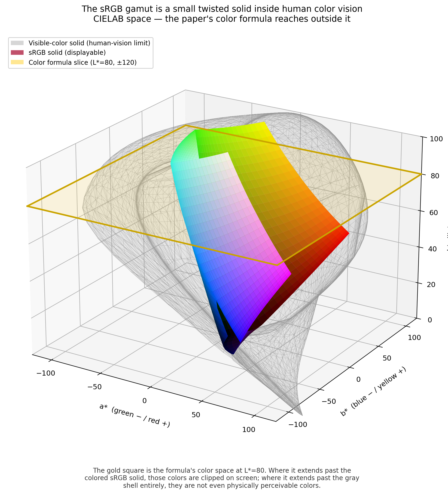

# The sRGB Gamut Inside Human Color Vision — A 3-D Lab Solid

`render_lab_solid_3d.py` produces a single still image: the **sRGB color
gamut**, drawn as its true twisted solid in CIELAB space, nested inside the
**visible-color solid** (the limit of human object-color perception), with
the paper's **color formula region** overlaid as a slice.

It is the 3-D parent of [`render-lab-gamut-tutorial.md`](render-lab-gamut-tutorial.md):
`render_lab_gamut.py` draws one horizontal slice through this solid at a
fixed `L*`; this script shows the whole solid, with that slice drawn in.



---

## 1. What the figure shows

CIELAB is a 3-D space with axes `(L*, a*, b*)` — lightness, green↔red,
blue↔yellow. The figure plots three things in the `(a*, b*, L*)` frame:

| Element | Color in figure | Meaning |
|---------|-----------------|---------|
| **Visible-color solid** | translucent gray shell | Every color a human can perceive (object colors under D65). CIELAB itself is unbounded, so *this* is the meaningful outer shell around sRGB. |
| **sRGB solid** | the colored twisted shape | Every color a standard monitor can display, painted with its real sRGB color. A small, lopsided lump inside the shell. |
| **Formula region** | gold square + outline | The paper's color formula at a fixed `L*`, sweeping `a*, b*` over `±ab_span`. A flat slice, because `L*` is held constant. |

The single-sentence argument the figure makes:

> The gold square is the region of color the formula addresses. Where it
> extends past the colored **sRGB solid**, those colors are silently
> **clipped** on screen. Where it extends past the gray **shell** entirely,
> they are not even physically perceivable colors. Only the part of the
> square that lies *inside* the colored solid is reproduced faithfully —
> and that is a small fraction of it.

---

## 2. How each element is computed

### 2a. The sRGB solid (warped cube)

The sRGB color space is the unit cube `[0, 1]³` in `(R, G, B)`. Under the
nonlinear sRGB→Lab transform that cube warps into a curved, twisted solid.
We render its **surface**: the 6 faces of the cube (each face fixes one of
R/G/B at 0 or 1 and grids the other two), convert every surface sample to
Lab with `skimage`'s `rgb2lab`, and draw each face as a `plot_surface` mesh
colored by its own sRGB value (`render_lab_solid_3d.py:srgb_faces`).

Because the transform is a continuous bijection, the 6 warped faces still
bound a closed solid — the colored shape you see. Drawing only the surface
(not a volume) keeps it light and lets the true face colors read directly.

### 2b. The visible-color solid (Rösch–MacAdam optimal-color solid)

This is the principled "outer shell." Its construction
(`render_lab_solid_3d.py:visible_color_solid_lab`) rests on one fact:

> **The set of all physically realizable object colors is convex in XYZ.**
> A reflectance spectrum is any function `R(λ) ∈ [0, 1]`. The map from a
> reflectance to its tristimulus `XYZ` (integrate `R(λ)` against the
> illuminant SPD and the CIE color-matching functions) is **linear**. The
> linear image of a convex set is convex, so the body of all object colors
> is convex.

The surface of a convex body is reached by its extreme points. For object
colors those are the **optimal colors**: reflectances that take only the
values 0 or 1, with at most two transitions — a band-pass (`1` on one
wavelength interval, `0` elsewhere) and its band-stop complement. So the
algorithm is:

1. Take the **CIE 1931 2° color-matching functions** `x̄, ȳ, z̄` and the
   **D65** illuminant SPD `S(λ)`, aligned to a common wavelength grid
   (default 380–720 nm at 5 nm) via `colour-science`.
2. Form per-wavelength weights `wₓ = k·S·x̄`, etc., with the normalization
   `k = 1 / Σ(S·ȳ)` so that a perfect reflector `R≡1` yields `Y = 1` — i.e.
   the D65 white point, matching this repo's Lab white.
3. Enumerate every band-pass reflectance `[i, j)` and its complement, using
   cumulative sums so each tristimulus integral is `O(1)`. Each gives one
   `XYZ` point on (or inside) the optimal-color surface; add pure black
   (`R≡0`) and white (`R≡1`).
4. Take the **convex hull** of all these `XYZ` points (`scipy.spatial`).
5. Convert the hull's vertices to Lab and draw its triangular faces as a
   translucent `Poly3DCollection`.

Note the hull is computed in **XYZ**, where the body is genuinely convex,
and only *then* mapped to Lab. Lab is a nonlinear warp of XYZ, so the shell
is curved in Lab even though it is a flat-faced hull in XYZ — exactly right.

### 2c. The formula region overlay

The paper's formula fixes `L*` and varies `a*, b*` over `[−ab_span, +ab_span]`.
That is a flat square at height `z = L*`, so it is drawn as a single
translucent gold quad plus a bold outline at that `L*`
(`render_lab_solid_3d.py`, the `--no-formula`-guarded block). The defaults
`L*=80, ab_span=120` match `render_lab_gamut.py`.

### 2d. One consistent white point

All three elements use the same D65 Lab white,
`(Xₙ, Yₙ, Zₙ) = (0.95047, 1.0, 1.08883)` — the value used throughout this
repo. `rgb2lab` assumes D65; the optimal-color integration is normalized to
the same white in step 2 above; and `xyz_to_lab` uses the same constants.
Without this the two solids would not share a coordinate frame and the
nesting would be meaningless.

---

## 3. Code usage

```
python render_lab_solid_3d.py [options]
```

| Flag | Default | Effect |
|------|---------|--------|
| `--out` | `lab_solid_3d.png` | Output PNG path. |
| `--L` | `80.0` | The paper's fixed `L*` for the formula slice plane. |
| `--ab-span` | `120.0` | Formula extent: `a*, b*` in `[−span, +span]`. |
| `--face-res` | `24` | Grid resolution per sRGB cube face (higher = smoother solid). |
| `--elev` | `22.0` | Camera elevation (degrees). |
| `--azim` | `-58.0` | Camera azimuth (degrees). |
| `--dpi` | `220` | Output resolution. |
| `--no-formula` | off | Omit the formula slice/box for a clean "shapes only" image. |

### Examples

Default figure (paper's `L*=80, ab_span=120`):
```bash
python render_lab_solid_3d.py --out lab_solid_3d.png
```

A candidate fix — watch the gold box shrink inside the sRGB solid:
```bash
python render_lab_solid_3d.py --L 60 --ab-span 45 --out fixed.png
```

Clean shapes-only image from a different angle (for intuition / a talk):
```bash
python render_lab_solid_3d.py --no-formula --elev 18 --azim -40 --out clean.png
```

### Dependencies

Beyond the repo's usual `numpy` / `matplotlib` / `scikit-image`:

- **`scipy`** — `ConvexHull` for the optimal-color solid.
- **`colour-science`** — CIE color-matching functions and the D65 SPD.
  Install with `pip install colour-science` (imported as `colour`).

---

## 4. Relationship to the 2-D gamut figure

| | `render_lab_gamut.py` (2-D) | `render_lab_solid_3d.py` (3-D) |
|--|--|--|
| View | One horizontal slice at fixed `L*` | The whole solid |
| sRGB region | Emergent from a grid inclusion test ([see note](render-lab-gamut-tutorial.md)) | Warped cube surface |
| Outer context | Formula `±ab_span` box on the plane | Visible-color shell + formula slice in 3-D |
| Data points | Reference haplotypes plotted on the slice | (not shown — this is a geometry figure) |
| Best for | Quantifying *which* and *how many* points clip | Intuition for *why*: sRGB is a small solid |

Use the 3-D still to make the conceptual case ("the formula reaches outside
what the display, and even the eye, can represent"), then the 2-D slice to
make it quantitative ("…and here are the N populations it clips").
